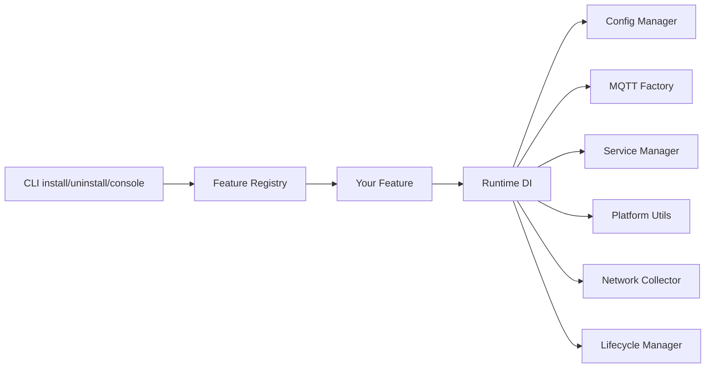

# Implementing a New Plugin

This guide explains how to add a new feature (plugin) to **Mew Agents** without modifying core infrastructure. The `shutdown` feature is the reference implementation.

## Overview

Mew Agents is a plugin-ready platform. The core application:

- Parses CLI commands (`install`, `uninstall`, `console`, hidden `run`)
- Resolves a feature by name from the registry
- Orchestrates configuration, service installation, and lifecycle

**Features own all business logic.** Adding a plugin requires only:

1. Create a new package under `internal/features/<name>/`
2. Register it in `internal/features/register.go`

You do **not** need to change:

- CLI handlers (`internal/app/commands.go`)
- Service infrastructure (`internal/service/`)
- Config infrastructure (`internal/config/`)
- MQTT factory (`internal/mqtt/`)
- Lifecycle manager (`internal/lifecycle/`)

## Architecture



Console mode and service mode call the **same** `Feature.Run()` method. The only differences are log destination and cancellation source (Ctrl+C vs OS service stop).

## Step-by-Step

### 1. Create the feature package

Create a directory:

```
internal/features/<feature-name>/
  feature.go    # Feature interface implementation
  config.go     # Config struct + validation
  install.go    # Kong-tagged install flags
  run.go        # Runtime logic (optional name; can live in feature.go)
```

Use lowercase, single-word feature names (e.g. `shutdown`, `inventory`, `metrics`).

### 2. Implement `registry.Feature`

Every plugin must satisfy the interface in [`internal/registry/feature.go`](../internal/registry/feature.go):

```go
type Feature interface {
    Name() string
    Description() string
    DefaultServiceName() string
    DefaultDisplayName() string

    NewConfig() Config
    ValidateConfig(cfg Config) error
    NewInstallFlags() any
    ConfigFromInstallFlags(flags any) (Config, error)

    Run(ctx context.Context, rt Runtime, cfg Config) error
}
```

| Method | Purpose |
|--------|---------|
| `Name()` | CLI feature name (e.g. `inventory`) |
| `Description()` | Short description shown in service metadata |
| `DefaultServiceName()` | OS service name (e.g. `mewagents-inventory`) |
| `DefaultDisplayName()` | Human-readable service name (e.g. `Mew Agents Inventory`) |
| `NewConfig()` | Return an empty config struct for JSON load/save |
| `ValidateConfig()` | Validate loaded or install-time configuration |
| `NewInstallFlags()` | Return a pointer to a Kong-tagged struct; used by `install` |
| `ConfigFromInstallFlags()` | Map parsed install flags to a `Config` value |
| `Run()` | Main runtime loop; identical for console and service modes |

### 3. Define configuration

Your config struct must implement `registry.Config`:

```go
type Config struct {
    BrokerURL string `json:"broker_url"`
    Interval  int    `json:"interval_seconds"`
}

func (c *Config) FeatureName() string { return "inventory" }

func (c *Config) Validate() error {
    if c.BrokerURL == "" {
        return fmt.Errorf("broker_url is required")
    }
    return nil
}
```

Configuration is stored per feature at:

| OS | Path |
|----|------|
| Windows | `%ProgramData%\MewAgents\<feature>\config.json` |
| Linux | `/etc/mewagents/<feature>/config.json` |
| macOS | `/Library/Application Support/MewAgents/<feature>/config.json` |

Each feature has its own directory. Config is never shared between features.

**Security:** Never log secrets (passwords, tokens). Use helpers like `mqtt.RedactedURL()` when logging broker URLs.

### 4. Define install flags

Install flags are parsed by Kong in a second pass after the feature name. Use struct tags:

```go
type InstallFlags struct {
    BrokerURL string `name:"broker-url" short:"b" required:"" help:"MQTT broker URL."`
    Interval  int    `name:"interval" short:"i" default:"60" help:"Report interval in seconds."`
}
```

Map flags to config in `ConfigFromInstallFlags`:

```go
func (f *Feature) ConfigFromInstallFlags(flags any) (registry.Config, error) {
    install, ok := flags.(*InstallFlags)
    if !ok {
        return nil, fmt.Errorf("invalid install flags type")
    }
    return &Config{
        BrokerURL: install.BrokerURL,
        Interval:  install.Interval,
    }, nil
}
```

Users install with:

```bash
mewagents install inventory --broker-url mqtt://broker.example.com:1883 --interval 30
```

### 5. Implement `Run`

`Run` is the heart of your plugin. Use injected dependencies from `registry.Runtime` — never construct MQTT clients, read config paths, or install services directly.

```go
func (f *Feature) Run(ctx context.Context, rt registry.Runtime, cfg registry.Config) error {
    c, ok := cfg.(*Config)
    if !ok {
        return fmt.Errorf("invalid config type")
    }
    if err := c.Validate(); err != nil {
        return err
    }

    logger := rt.Logger().With("feature", f.Name())

    // Example: connect to MQTT with automatic reconnect
    conn, err := rt.MQTT().Connect(ctx, registry.MQTTOptions{
        Feature:  f.Name(),
        Broker:   c.BrokerURL,
        Username: c.Username,
        Password: c.Password,
        Logger:   logger,
        OnUp: func(cm *autopaho.ConnectionManager, ack *paho.Connack) {
            // Re-subscribe here; called on every reconnect
        },
    })
    if err != nil {
        return err
    }
    defer func() {
        disconnectCtx, cancel := context.WithTimeout(context.Background(), 5*time.Second)
        defer cancel()
        _ = conn.Disconnect(disconnectCtx)
    }()

    logger.Info("feature running")

    // Block until shutdown
    <-ctx.Done()
    logger.Info("feature stopping")
    return ctx.Err()
}
```

#### Runtime dependencies

Access shared services through `registry.Runtime`:

| Method | Use for |
|--------|---------|
| `Logger()` | Structured logging (`log/slog`) |
| `Config()` | Load/save feature config (usually not needed in `Run`; core loads config before calling `Run`) |
| `MQTT()` | MQTT v5 connections via autopaho (automatic reconnect) |
| `Platform()` | OS-specific paths, file permissions, system shutdown |
| `Network()` | Active MAC address detection |
| `Lifecycle()` | Background goroutine tracking, signal handling |
| `Context()` | Root process context |

`Service()` is used by the core platform, not typically by features.

#### Graceful shutdown rules

- Accept `ctx context.Context` and respect cancellation
- Use `select` or `<-ctx.Done()` in long-running loops
- Stop background goroutines when `ctx` is cancelled
- Disconnect MQTT and release resources in defer or after `<-ctx.Done()`
- Do not use global state

### 6. Register the feature

Add one line to [`internal/features/register.go`](../internal/features/register.go):

```go
func RegisterAll(r *registry.Registry) {
    r.Register(shutdown.New())
    r.Register(inventory.New()) // your feature
}
```

Duplicate names panic at startup — this is intentional.

### 7. Test your plugin

Add tests in your feature package:

```
internal/features/<feature-name>/
  config_test.go
  run_test.go       # if testable without live MQTT
  handler_test.go   # table-driven message/event tests
```

Run:

```bash
go test ./internal/features/<feature-name>/...
go vet ./...
```

Use `export_test.go` (same package name, `_test.go` suffix) to expose internal types to external test packages when needed. See `internal/features/shutdown/export_test.go`.

## Minimal Skeleton

```go
// internal/features/inventory/feature.go
package inventory

import (
    "context"
    "fmt"

    "github.com/mewisme/MewAgents/internal/registry"
)

const featureName = "inventory"

type Feature struct{}

func New() *Feature { return &Feature{} }

func (f *Feature) Name() string               { return featureName }
func (f *Feature) Description() string        { return "Collect and report machine inventory." }
func (f *Feature) DefaultServiceName() string { return "mewagents-inventory" }
func (f *Feature) DefaultDisplayName() string { return "Mew Agents Inventory" }

func (f *Feature) NewConfig() registry.Config { return &Config{} }

func (f *Feature) ValidateConfig(cfg registry.Config) error {
    c, ok := cfg.(*Config)
    if !ok {
        return fmt.Errorf("invalid config type for %s feature", featureName)
    }
    return c.Validate()
}

func (f *Feature) NewInstallFlags() any { return &InstallFlags{} }

func (f *Feature) ConfigFromInstallFlags(flags any) (registry.Config, error) {
    install, ok := flags.(*InstallFlags)
    if !ok {
        return nil, fmt.Errorf("invalid install flags type for %s feature", featureName)
    }
    return &Config{BrokerURL: install.BrokerURL}, nil
}

func (f *Feature) Run(ctx context.Context, rt registry.Runtime, cfg registry.Config) error {
    c, ok := cfg.(*Config)
    if !ok {
        return fmt.Errorf("invalid config type for %s feature", featureName)
    }
    logger := rt.Logger().With("feature", featureName)
    logger.Info("inventory feature running", "broker", c.RedactedURL())
    <-ctx.Done()
    return ctx.Err()
}
```

## CLI Commands (automatic)

Once registered, your feature is available immediately:

```bash
# Install as OS service (validates config, saves config.json, registers service)
mewagents install <feature> [flags]

# Remove service (config file is kept)
mewagents uninstall <feature>

# Run in foreground with console logging and Ctrl+C shutdown
mewagents console <feature>
```

Unknown feature names produce a clear error listing all registered features:

```
unknown feature "foo"; supported: inventory, shutdown
```

The hidden `run <feature>` command is invoked by the OS service manager — you do not call it manually.

## Install Lifecycle (handled by core)

When a user runs `mewagents install <feature>`, the core platform:

1. Resolves the feature from the registry
2. Parses feature-specific install flags (second Kong parse)
3. Calls `ConfigFromInstallFlags` and `ValidateConfig`
4. Saves config to the platform config path
5. Registers an OS service named `DefaultServiceName()` with arguments `run <feature>`

Your feature does not implement install logic directly.

## Uninstall Lifecycle (handled by core)

When a user runs `mewagents uninstall <feature>`, the core platform:

1. Stops the service if running
2. Removes the service registration
3. **Leaves** `config.json` intact

## Reference Implementation

Study the shutdown feature for a complete, production-quality example. User-facing docs: [Shutdown feature](../features/shutdown.md).

| File | Responsibility |
|------|----------------|
| [`feature.go`](../internal/features/shutdown/feature.go) | Interface implementation, install flag mapping |
| [`config.go`](../internal/features/shutdown/config.go) | Config struct, validation, redacted logging |
| [`install.go`](../internal/features/shutdown/install.go) | Kong install flags |
| [`run.go`](../internal/features/shutdown/run.go) | MQTT connect, subscribe, graceful shutdown |
| [`handler.go`](../internal/features/shutdown/handler.go) | MQTT topic handling |
| [`pending.go`](../internal/features/shutdown/pending.go) | In-memory state with mutex + TTL |

## Design Checklist

Before opening a PR for a new plugin, verify:

- [ ] Feature implements all `registry.Feature` methods
- [ ] Feature is registered in `internal/features/register.go`
- [ ] Config implements `FeatureName()` and validates all required fields
- [ ] Install flags use Kong struct tags (`name`, `short`, `required`, `help`)
- [ ] Secrets are never logged
- [ ] `Run` respects `ctx` cancellation and cleans up resources
- [ ] Console and service modes share the same `Run` implementation
- [ ] No imports from `internal/app` (avoid import cycles)
- [ ] Dependencies consumed via `registry.Runtime` interfaces only
- [ ] No global mutable state
- [ ] Unit tests cover config validation and core logic
- [ ] `gofmt`, `go vet`, and `go test` pass

## Common Patterns

### MQTT feature

1. Validate broker URL with `mqtt.ParseBrokerURL()` before saving config
2. Connect via `rt.MQTT().Connect()` with `OnUp` for subscriptions (re-runs on reconnect)
3. Register message handlers with `conn.AddOnPublishReceived()`
4. Use QoS 1 for subscriptions when delivery matters
5. Disconnect on context cancellation

### Platform-specific behavior

Use `rt.Platform()` for OS-specific operations. Add new platform capabilities to `internal/platform/` only when multiple features need them — not for feature-specific logic.

### Background work

Track goroutines with `rt.Lifecycle().Run(ctx, fn)` if you need coordinated shutdown, or manage goroutines manually with `ctx` cancellation.

## What Not to Do

- Do not modify `internal/app/commands.go` for feature-specific behavior
- Do not hardcode feature names in core packages
- Do not share config files between features
- Do not shell out with user-controlled input (`exec.Command("sh", "-c", ...)`)
- Do not read config from hardcoded paths; use `rt.Config()` if needed at runtime
- Do not install or uninstall OS services from feature code

## Getting Help

- Feature interface: [`internal/registry/feature.go`](../internal/registry/feature.go)
- Runtime interfaces: [`internal/registry/runtime.go`](../internal/registry/runtime.go)
- Working example: [`internal/features/shutdown/`](../internal/features/shutdown/)
- User documentation: [Shutdown feature](../features/shutdown.md)
- Architecture plan: [`.cursor/plans/mew_agents_platform_89e47918.plan.md`](../.cursor/plans/mew_agents_platform_89e47918.plan.md)
